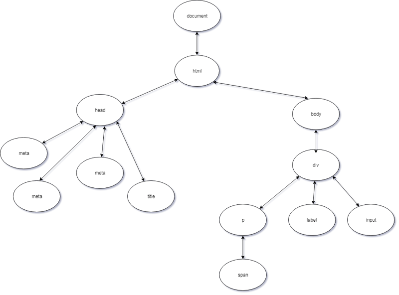

- DOM stands for Document Object Model is an interface (API) for HTML and XML documents.

- When the browser first reads (parses) our HTML document it creates a big object, a really big object based on the HTML document this is the DOM. 

- It is a tree-like structure that is modeled from the HTML document. The DOM is used for interacting and modifying the DOM structure or specific Elements or Nodes.

Imagine if we have an HTML structure like this.
```html
<!DOCTYPE html>
<html lang="en">

<head>
   <meta charset="UTF-8">
   <meta name="viewport" content="width=device-width, initial-scale=1.0">
   <meta http-equiv="X-UA-Compatible" content="ie=edge">
   <title>Document Object Model</title>
</head>

<body>
   <div>
      <p>
         <span></span>
      </p>
      <label></label>
      <input>
   </div>
</body>

</html>

```
The DOM equivalent would be like this.


The document object in JavaScript represents the DOM. It provides us many methods that we can use to selecting elements to update element contents and many more.