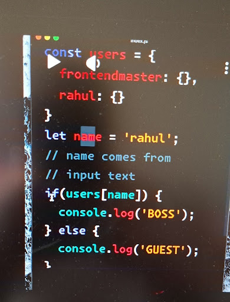

The core bug in this code is a **Prototype Property Collision / False Positive** when dynamic user input matches built-in object properties.

---

### Why it Fails

Because `users` is initialized as a plain object literal (`{}`), it inherits built-in properties and methods from **`Object.prototype`** (e.g., `toString`, `valueOf`, `hasOwnProperty`, `constructor`, `isPrototypeOf`).

If a user enters **`toString`** as the input:

```javascript
let name = 'toString';

if (users[name]) {
  console.log('BOSS'); // ⚠️ Logs 'BOSS' instead of 'GUEST'!
}

```

* `users['toString']` evaluates to `[Function: toString]`.
* Since functions are truthy in JavaScript, the condition evaluates to `true`, mistakenly granting `'BOSS'` access to a non-existent user.

---

### The Solutions

#### 1. Use `Object.hasOwn()` (ES2022+ / Modern Standard)

Checks only the object's direct own properties without touching the prototype chain:

```javascript
if (Object.hasOwn(users, name)) {
  console.log('BOSS');
} else {
  console.log('GUEST');
}

```

---

#### 2. Create a Prototype-Less Object (`Object.create(null)`)

Removes inheritance from `Object.prototype`, so keys like `'toString'` evaluate to `undefined`:

```javascript
const users = Object.create(null);
users.frontendmaster = {};
users.rahul = {};

if (users[name]) {
  console.log('BOSS');
} else {
  console.log('GUEST');
}

```

---

#### 3. Use `Set` (Best Data Structure for Membership Checks)

```javascript
const users = new Set(['frontendmaster', 'rahul']);

if (users.has(name)) {
  console.log('BOSS');
} else {
  console.log('GUEST');
}

```
