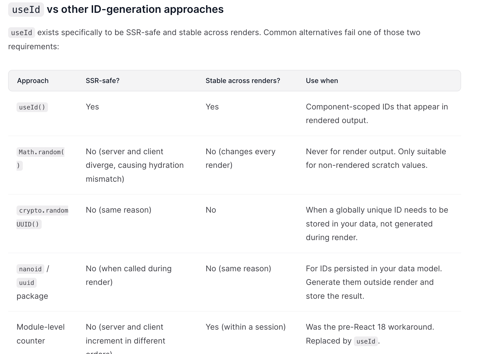

**What is the useId hook in React and when should it be used?**
**Introduction to useId**
The useId hook was added in React 18. It returns a stable string ID tied to the component instance's position in the tree. The ID is the same on every render of that instance, and — crucially — it is the same on the server and the client.

**Why useId exists: SSR and hydration**
The actual motivation for useId is server-side rendering. Before React 18, generating IDs with a module-level counter (let next = 0; const id = next++;) caused hydration mismatches: the server and the client could increment the counter in a different order, producing different IDs in the HTML versus the client tree. React would then warn (and in React 18+, throw away the hydrated subtree).

Module-level counters were already fragile before React 18. Any re-render, multiple renderToString calls sharing module state, or a tree shape that differed between server and client could desynchronize the counter. React 18's concurrent rendering and streaming SSR amplified the problem: Suspense boundaries can resolve out of order, the renderer can pause and resume work, and streamed chunks can arrive at the client in a different order than they were rendered on the server. Any ID source that depends on render order (counters, Math.random() seeded once, mutable module state) inherits this fragility.

useId sidesteps it by deriving the ID from the component's location in the React tree, which is identical on the server and the client regardless of render order. Producing IDs unique to one component instance is a side benefit; the main job is hydration stability.

**useId vs other ID-generation approaches**
useId exists specifically to be SSR-safe and stable across renders. Common alternatives fail one of those two requirements:



If an ID appears in rendered output, it must come from useId. If an ID belongs to your data (a row's primary key, a user's session ID, and so on), generate it outside render and store it.

If an ID appears in rendered output, it must come from useId. If an ID belongs to your data (a row's primary key, a user's session ID, and so on), generate it outside render and store it.

**useId in React Server Components**
useId behaves inside Client Components the same way it does in plain client React. Two caveats apply specifically to RSC setups:

It works in synchronous Server Components but is not supported in async Server Components. If an ID is required inside an async Server Component, generate it outside render or move the rendering into a Client Component.
IDs are derived from the component's position in the fiber tree, including any surrounding Suspense boundaries. There is no per-Suspense namespace. The boundary is simply another node in the parent path, which is what keeps IDs in different boundaries distinct.
Server Actions are unrelated to ID generation. They run on the server and do not participate in render-time ID generation.
Uniqueness scope and multiple roots
IDs from useId are unique within a single React root. If your page mounts more than one root (for example, an island-style architecture, or a widget you embed into a host page that also uses React), two separate roots can both generate :r0: and collide.

To prevent that, give each root a distinct identifierPrefix:

```js
import { createRoot } from "react-dom/client";

createRoot(document.getElementById("widget-a"), {
  identifierPrefix: "a-",
}).render(<WidgetA />);

createRoot(document.getElementById("widget-b"), {
  identifierPrefix: "b-",
}).render(<WidgetB />);
```

The same option exists on hydrateRoot.

When to use useId
The most common use is associating a <label> with its form control for accessibility:

```js
import { useId } from "react";

function NameField() {
  const id = useId();
  return (
    <div>
      <label htmlFor={id}>Name:</label>
      <input id={id} type="text" />
    </div>
  );
}
```

It is also useful for ARIA attributes such as aria-describedby, aria-labelledby, and aria-controls.

Pairing inputs with aria-describedby and aria-labelledby
A common useId pattern for accessibility is connecting an input to a hint, an error message, or an external label via aria-describedby or aria-labelledby. Call useId once per component and append suffixes for each related element. This keeps related IDs grouped, saves hook calls, and makes the relationships clear in the markup:

```js
function PasswordField() {
  const id = useId();
  return (
    <>
      <label htmlFor={`${id}-password`}>Password:</label>
      <input
        id={`${id}-password`}
        type="password"
        aria-describedby={`${id}-hint`}
      />
      <p id={`${id}-hint`}>Must be at least 12 characters.</p>
    </>
  );
}
```

The same pattern applies to aria-labelledby (when the label is a separate element, not a <label>), aria-controls (a button that toggles a panel), and aria-errormessage (an input pointing at an error region). All of these attributes need stable IDs that survive SSR, which is what useId provide

**What useId is not for**
**Important distinction:** useId is not a replacement for list keys. key identifies a piece of data across renders so React can reconcile additions, removals, and reorders. useId identifies a component position in the tree, so it stays the same when the list is reordered, which is the wrong behavior for a key. Always use a stable ID from your data (a database id, a slug, and so on) for list keys.

Do not use it as a list key. Using useId as a key produces output that renders correctly at first but breaks when the list is reordered or items are inserted. See the callout above for the reason.
Avoid it in CSS selectors and document.querySelector. The generated format (e.g. :r0:) contains colons, which are valid in HTML id attributes but require escaping in CSS selectors. Pair <label htmlFor> with <input id> instead of selecting by id.
Do not parse or rely on the format. The exact shape (:r0:, «r0», etc.) is an implementation detail and has changed between versions.
Do not generate IDs for data with useId. If the ID must outlive the component (saved to a database, sent in an API request, used as a stable record identifier), useId is not the right tool. Use crypto.randomUUID() or a UUID library and store the result.
**Practical guidance**
Always pair the generated id with the element via htmlFor / id (or the relevant aria-\* attribute) — never use it as decoration.
Concatenate suffixes for related controls instead of calling useId repeatedly.
Set identifierPrefix on each root if your app mounts more than one.
Reach for useId only when you actually need a generated id; many components can simply accept an id prop from the parent.
