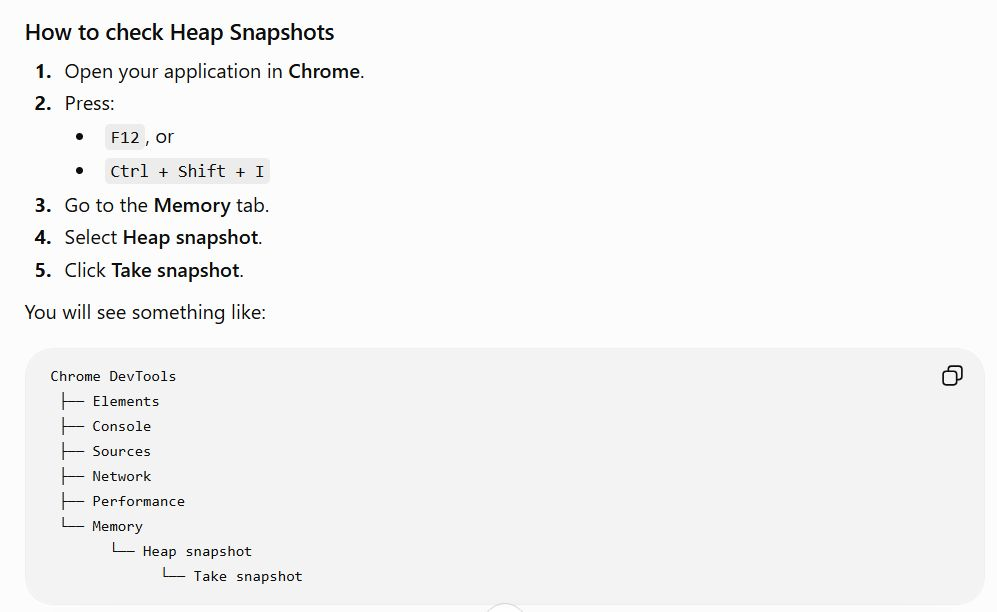

*** copy How do you find Memory Leaks in a Frontend Application?.md ***

***How do you find Memory Leaks in a Frontend Application?***

One of the most useful tools is Chrome DevTools → Memory → Heap Snapshot.
🔹 Take the first snapshot
🔹 Perform the action that may cause the leak
🔹 Take another snapshot
🔹 Compare retained objects and detached DOM nodes
🧹 Common cleanup:
setInterval → clearInterval
Event listeners → removeEventListener
Subscriptions → unsubscribe
WebSocket → close
Observers → disconnect
Fetch → AbortController
⚛️ Final Note(Interview Best Answer):
I prevent memory leaks by cleaning up resources created by components, such as timers, event listeners, subscriptions, WebSockets, observers, and pending network requests. In React, I generally use the cleanup function of useEffect. I also use Chrome DevTools Memory and heap snapshots to identify retained objects and detached DOM nodes.

