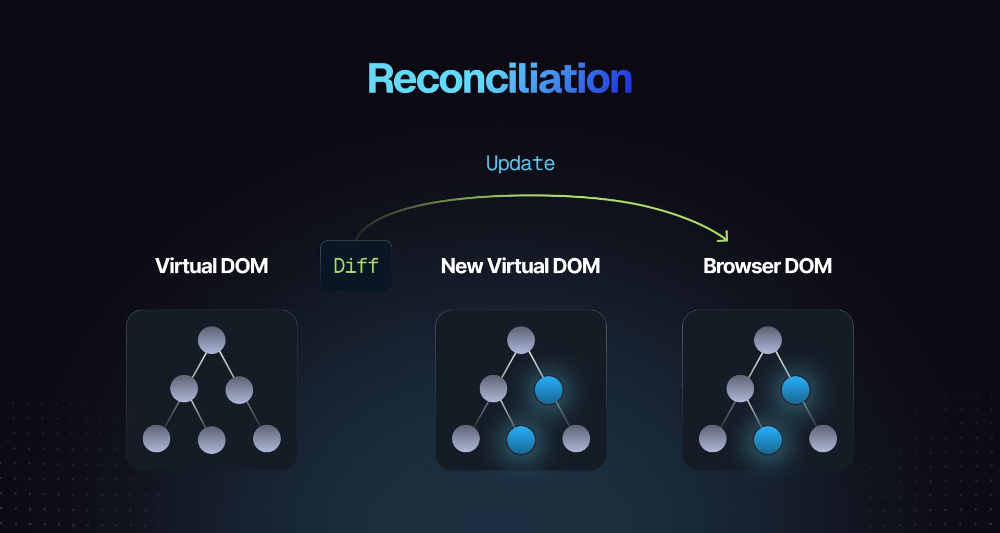

**Reconciliation** is the core algorithm React uses to determine **what parts of the UI need to change** when a component’s state or props update, and how to update them efficiently.

When you trigger a re-render, React doesn't blindly wipe out the entire Document Object Model (DOM) and redraw the page from scratch (which would be extremely slow). Instead, it uses reconciliation to compare the old UI tree with the new UI tree and apply only the surgical changes required.

---

### How Reconciliation Works (The 3-Step Process)

1. **The Virtual DOM Tree Generation:** When state changes, your component runs again, returning a fresh tree of React elements (the Virtual DOM).
2. **The Diffing Algorithm:** React compares this new tree against the previous tree using heuristic algorithms (optimized down to $O(n)$ time complexity by making two primary assumptions: different types of elements produce different trees, and list items can be tracked using stable `key` props).
3. **The Commit Phase:** Once React figures out the exact differences (e.g., _"Change this specific text node from 'Loading' to 'Done'"_), it hands those minimal instructions over to the renderer (like `react-dom`) to update the real browser DOM.

