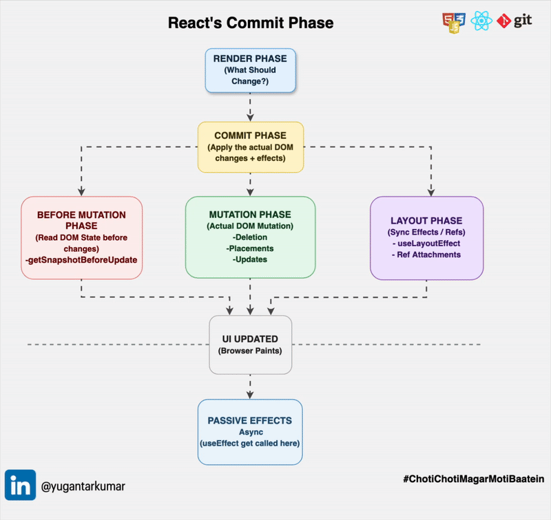

𝗧𝗵𝗲 𝗥𝗲𝗻𝗱𝗲𝗿 𝗣𝗵𝗮𝘀𝗲 𝗱𝗲𝗰𝗶𝗱𝗲𝘀 𝘄𝗵𝗮𝘁 𝗻𝗲𝗲𝗱𝘀 𝘁𝗼 𝗰𝗵𝗮𝗻𝗴𝗲. 𝗧𝗵𝗲 𝗖𝗼𝗺𝗺𝗶𝘁 𝗣𝗵𝗮𝘀𝗲 𝗺𝗮𝗸𝗲𝘀 𝗶𝘁 𝗵𝗮𝗽𝗽𝗲𝗻. 𝗧𝗵𝗶𝘀 𝗶𝘀 𝘄𝗵𝗲𝗿𝗲 𝗥𝗲𝗮𝗰𝘁 𝗳𝗶𝗻𝗮𝗹𝗹𝘆 𝘁𝗼𝘂𝗰𝗵𝗲𝘀 𝘁𝗵𝗲 𝗿𝗲𝗮𝗹 𝗗𝗢𝗠. 𝗛𝗲𝗿𝗲'𝘀 𝗵𝗼𝘄 👇

In the last post (link in the comments) we covered how React prioritizes updates using Lanes.
Once React knows what to work on and has finished the Render Phase, then the Commit Phase begins.

𝗪𝗵𝗮𝘁 𝗶𝘀 𝘁𝗵𝗲 𝗖𝗼𝗺𝗺𝗶𝘁 𝗣𝗵𝗮𝘀𝗲?
This is where all the changes React prepared during the Render Phase are applied to the actual DOM.
𝗢𝗻𝗲 𝗸𝗲𝘆 𝗰𝗵𝗮𝗿𝗮𝗰𝘁𝗲𝗿𝗶𝘀𝘁𝗶𝗰 is that unlike the Render Phase, the Commit Phase is 𝘀𝘆𝗻𝗰𝗵𝗿𝗼𝗻𝗼𝘂𝘀 and 𝗯𝗹𝗼𝗰𝗸𝗶𝗻𝗴.
Once it starts, it cannot be paused or interrupted. It must finish before the browser can paint again.
This is intentional. Partial DOM updates would leave the UI in an inconsistent state visible to the user.

𝗧𝗵𝗲 𝗖𝗼𝗺𝗺𝗶𝘁 𝗣𝗵𝗮𝘀𝗲 𝗵𝗮𝘀 𝟰 𝘀𝘂𝗯-𝗽𝗵𝗮𝘀𝗲𝘀:

𝗕𝗲𝗳𝗼𝗿𝗲 𝗠𝘂𝘁𝗮𝘁𝗶𝗼𝗻
React's last chance to read the current DOM before any changes are made. This is where getSnapshotBeforeUpdate runs. (more on this in the next post)

𝗠𝘂𝘁𝗮𝘁𝗶𝗼𝗻 𝗣𝗵𝗮𝘀𝗲
The actual DOM changes happen here i.e deletions, insertions and updates applied in that exact order.

𝗟𝗮𝘆𝗼𝘂𝘁 𝗣𝗵𝗮𝘀𝗲
Runs after DOM mutations but before the browser paints. Refs are attached and useLayoutEffect callbacks fire synchronously here.

𝗣𝗮𝘀𝘀𝗶𝘃𝗲 𝗘𝗳𝗳𝗲𝗰𝘁𝘀
After the browser has painted, React runs useEffect callbacks asynchronously. This is non-blocking and does not delay what the user sees.

𝗧𝗵𝗲 𝘀𝗶𝗺𝗽𝗹𝗲 𝘄𝗮𝘆 𝘁𝗼 𝗿𝗲𝗺𝗲𝗺𝗯𝗲𝗿 𝗶𝘁:
𝗥𝗲𝗻𝗱𝗲𝗿 𝗣𝗵𝗮𝘀𝗲: figures out what to change, interruptible, no DOM touched. 𝗖𝗼𝗺𝗺𝗶𝘁 𝗣𝗵𝗮𝘀𝗲: applies the changes, synchronous, blocking, DOM is touched here

𝗣𝗮𝗿𝘁 𝟳: 𝗧𝗵𝗲 𝗖𝗼𝗺𝗺𝗶𝘁 𝗣𝗵𝗮𝘀𝗲

- How React shifts from planning to doing
- why the Commit Phase is synchronous and blocking
  and the 4 sub-phases that run in strict order before the user sees anything.

𝗣𝗮𝗿𝘁 𝟴: 𝗕𝗲𝗳𝗼𝗿𝗲 𝗠𝘂𝘁𝗮𝘁𝗶𝗼𝗻 𝗣𝗵𝗮𝘀𝗲

- React's last chance to read the DOM before it changes
- how getSnapshotBeforeUpdate captures scroll positions
  and layout measurements that would be permanently lost after the update.

𝗣𝗮𝗿𝘁 𝟵: 𝗠𝘂𝘁𝗮𝘁𝗶𝗼𝗻 𝗣𝗵𝗮𝘀𝗲

- Where React actually touches the real DOM
- why deletions always run before placements, placements before updates
  and why children are always committed before their parents.

𝗧𝗵𝗲 𝗠𝘂𝘁𝗮𝘁𝗶𝗼𝗻 𝗣𝗵𝗮𝘀𝗲 𝗶𝘀 𝘄𝗵𝗲𝗿𝗲 𝗥𝗲𝗮𝗰𝘁 𝗳𝗶𝗻𝗮𝗹𝗹𝘆 𝘁𝗼𝘂𝗰𝗵𝗲𝘀 𝘁𝗵𝗲 𝗿𝗲𝗮𝗹 𝗗𝗢𝗠. 𝗕𝘂𝘁 𝗶𝘁 𝗱𝗼𝗲𝘀𝗻'𝘁 𝗱𝗼 𝗶𝘁 𝗿𝗮𝗻𝗱𝗼𝗺𝗹𝘆. There is a strict order and breaking it would leave your UI in an inconsistent state. Here's how 👇

This is the second sub-phase of the Commit Phase. All the changes React prepared during the Render Phase get applied here i.e deletions, insertions and updates.

𝗪𝗵𝘆 𝘁𝗵𝗲 𝗼𝗿𝗱𝗲𝗿 𝗺𝗮𝘁𝘁𝗲𝗿𝘀: React applies mutations in a strict 3-step order. This is not arbitrary.

𝟭. 𝗗𝗲𝗹𝗲𝘁𝗶𝗼𝗻𝘀 𝗳𝗶𝗿𝘀𝘁: Old DOM nodes are removed before anything else which
prevents duplicate key or ID conflicts.

- If an element with the same key is being replaced, the old one must go before the new one comes in.
- Clears the position so new nodes can be inserted cleanly.
- Runs cleanup where event listeners are detached, refs are cleared, preventing memory leaks.

𝟮. 𝗣𝗹𝗮𝗰𝗲𝗺𝗲𝗻𝘁𝘀 𝗻𝗲𝘅𝘁: Newly created DOM nodes are inserted where

- Parent nodes already exist at this point.
- Deleted nodes are already gone/
- React inserts new elements into correct positions without interference.

𝟯. 𝗨𝗽𝗱𝗮𝘁𝗲𝘀 𝗹𝗮𝘀𝘁: Here, existing DOM nodes are updated like text changes, attribute modifications, style changes, event listener adjustments.

- Updates run last so React always operates against a stable, fully-formed DOM structure.

𝗧𝗿𝗮𝘃𝗲𝗿𝘀𝗮𝗹 𝗼𝗿𝗱𝗲𝗿: During the Mutation Phase, React walks the fiber tree in depth-first post-order i.e. children are always mutated before their parents.

- This guarantees DOM consistency and correct execution order for the effects that follow.

𝗧𝗵𝗲 𝘀𝗶𝗺𝗽𝗹𝗲 𝘄𝗮𝘆 𝘁𝗼 𝗿𝗲𝗺𝗲𝗺𝗯𝗲𝗿 𝗶𝘁:
𝗗𝗲𝗹𝗲𝘁𝗶𝗼𝗻𝘀: remove what's gone
𝗣𝗹𝗮𝗰𝗲𝗺𝗲𝗻𝘁𝘀: insert what's new
𝗨𝗽𝗱𝗮𝘁𝗲𝘀: change what's different

- Always in that order. Never the other way around.

𝗪𝗵𝘆 𝘁𝗵𝗶𝘀 𝗺𝗮𝘁𝘁𝗲𝗿𝘀:

- Now you know why React never partially updates the DOM. The strict order prevents inconsistent UI states
- Why key conflicts cause unexpected behaviour. Deletions run first to clear them
- Why children are always committed before parents. Post-order traversal guarantees this
