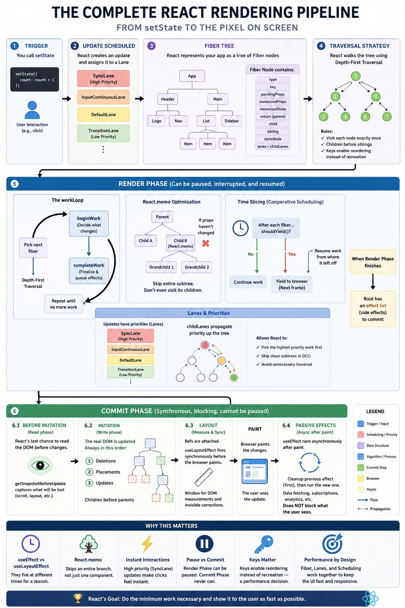

𝗵𝗼𝘄 𝗥𝗲𝗮𝗰𝘁 𝗮𝗰𝘁𝘂𝗮𝗹𝗹𝘆 𝘄𝗼𝗿𝗸𝘀. Here's the complete journey👇

It starts with a problem. React's original Stack Reconciler rendered your entire component tree in one synchronous, uninterruptible pass with no pausing, no prioritizing.
So React rebuilt its entire rendering engine from scratch.

𝗥𝗲𝗮𝗰𝘁 𝗙𝗶𝗯𝗲𝗿: a scheduler that gives every element its own fiber node. Together they form a tree React can walk, pause, and resume at will using 𝗱𝗲𝗽𝘁𝗵-𝗳𝗶𝗿𝘀𝘁 𝘁𝗿𝗮𝘃𝗲𝗿𝘀𝗮𝗹.

- Every node visited exactly once, keys enabling React to reorder instead of recreate.

This powers the 𝗥𝗲𝗻𝗱𝗲𝗿 𝗣𝗵𝗮𝘀𝗲, where the 𝘄𝗼𝗿𝗸𝗟𝗼𝗼𝗽 picks one fiber at a time.

- 𝗯𝗲𝗴𝗶𝗻𝗪𝗼𝗿𝗸 decides what changes.
- This is where React.memo skips entire subtrees when props haven't changed.
- 𝗰𝗼𝗺𝗽𝗹𝗲𝘁𝗲𝗪𝗼𝗿𝗸 finalises the fiber and queues side effects. But the workLoop doesn't run blindly.
- 𝗧𝗶𝗺𝗲 𝗦𝗹𝗶𝗰𝗶𝗻𝗴 gives it a budget shouldYield() which checks if the frame is running out after every fiber.
- If it is, React yields to the browser and resumes on the next frame. Greedy renderer becomes cooperative.

And when multiple updates compete?

- 𝗟𝗮𝗻𝗲𝘀 decide who goes first where
- a click lands in SyncLane
- a startTransition update lands in TransitionLane.

- 𝗖𝗵𝗶𝗹𝗱𝗟𝗮𝗻𝗲𝘀 propagate priorities upward so React can skip clean subtrees in O(1), without traversing them.

Once the Render Phase is done, the 𝗖𝗼𝗺𝗺𝗶𝘁 𝗣𝗵𝗮𝘀𝗲 begins.Synchronous. Blocking. Cannot be paused.

- 𝗕𝗲𝗳𝗼𝗿𝗲 𝗠𝘂𝘁𝗮𝘁𝗶𝗼𝗻 is React's last chance to read the DOM before it changes.
- getSnapshotBeforeUpdate captures scroll positions and layout measurements that would otherwise be lost.

- 𝗠𝘂𝘁𝗮𝘁𝗶𝗼𝗻 applies deletions first, placements next, updates last always in that order, children before parents. This is where the real DOM finally changes.

- 𝗟𝗮𝘆𝗼𝘂𝘁 attaches refs and fires useLayoutEffect synchronously, before the browser paints, the only window for DOM measurements and invisible corrections.
  The browser paints. The user sees the update.

And finally 𝗣𝗮𝘀𝘀𝗶𝘃𝗲 𝗘𝗳𝗳𝗲𝗰𝘁𝘀.

- useEffect runs asynchronously after paint, cleanup first then the new callback.
  Data fetching, subscriptions, analytics, none of it blocks what the user sees. Intentional, by design.
  That is the complete React rendering pipeline.

This image is an excellent end-to-end visualisation of React's rendering pipeline, showing what happens from a setState() call all the way to pixels appearing on screen.

High-Level Flow
setState()
↓
Update Scheduled
↓
Fiber Tree Traversal
↓
Render Phase (can pause)
↓
Commit Phase (cannot pause)
↓
Browser Paint
↓
useEffect

1. Trigger
   setState({
   count: count + 1,
   });

A user interaction (click, input, scroll) triggers a state update.

React does not immediately update the DOM.

Instead, it creates an Update object.

2. Update Scheduling (Lanes)

React assigns priority using Lanes.

SyncLane Highest Priority
InputContinuousLane
DefaultLane
TransitionLane Lowest Priority

Examples:

// High Priority
setCount(count + 1);

// Low Priority
startTransition(() => {
setSearchResults(data);
});

The Scheduler uses lanes to decide:

What should run first?
What can wait?

3. Fiber Tree

React converts your component tree into a Fiber Tree.

Example:

App
├── Header
│ ├── Logo
│ └── Nav
└── Main
├── List
└── Sidebar

Each component becomes a Fiber node.

A Fiber stores:

type
key
pendingProps
memoizedProps
memoizedState
child
sibling
return
lanes

Think of Fiber as:

React's Virtual Stack Frame

It allows React to:

Pause work
Resume work
Restart work
Prioritise work

4. Traversal Strategy

React uses:

Depth-First Traversal (DFS)

Example:

        1
      /   \
     2     5
    / \   / \

3 4 6 7

Traversal:

1
2
3
4
5
6
7

Rules:

Visit node once
Go deep before siblings
Use keys for reconciliation

5. Render Phase

This is the most misunderstood React phase.

The image correctly highlights:

Render Phase
✅ Can pause
✅ Can resume
✅ Can restart
✅ Can be interrupted

Nothing touches the real DOM here.

beginWork()

React checks:

Did props change?
Did state change?
Did context change?

Example:

function User({ name }) {
return <div>{name}</div>;
}

React computes:

What the UI should look like

completeWork()

After finishing children:

Prepare DOM mutations
Collect Effects
Build Effect List

Still:

NO DOM changes yet

React.memo Optimization

The diagram correctly shows:

const Child = React.memo(Component);

If props haven't changed:

Skip Child
Skip Grandchildren
Skip Entire Subtree

This is huge for performance.

Without memo:

Parent render
↓
Child render
↓
Grandchild render

With memo:

Parent render
↓
Child skipped
↓
Grandchild skipped

Time Slicing

One of React Fiber's biggest innovations.

During render:

Work
↓
Should Yield?
↓
Yes
↓
Return control to browser
↓
Continue later

Example:

Render 10,000 rows

React may:

Render 100
Pause
Browser paints
Resume

This keeps the UI responsive.

childLanes Propagation

The image shows:

childLanes

This is extremely important.

If a grandchild needs work:

Grandchild
↑
Child
↑
Parent

Priority bubbles upward.

This allows React to know:

Which subtree contains work

without scanning everything.

Render Phase Result

When Render finishes:

Root Fiber
↓
Effect List Ready

React now knows:

What needs to change

but still hasn't touched the DOM.

6. Commit Phase

The image correctly highlights:

Synchronous
Blocking
Cannot be interrupted

Once Commit starts:

Must finish

6.1 Before Mutation Phase

React reads DOM state before changes.

Used by:

getSnapshotBeforeUpdate()

Example:

getSnapshotBeforeUpdate() {
return list.scrollTop;
}

This is the last chance to inspect the old DOM.

6.2 Mutation Phase

Actual DOM work happens now.

Order shown in image:

1. Deletions
2. Placements
3. Updates

Examples:

Remove nodes
Insert nodes
Update text
Update attributes

Real DOM changes occur here.

6.3 Layout Phase

This is where:

Refs attach
useLayoutEffect runs

Order:

DOM Exists
↓
Ref Assigned
↓
useLayoutEffect

Example:

useLayoutEffect(() => {
ref.current.focus();
}, []);

Works because:

DOM already exists
Paint has not happened yet

Perfect for:

Measurements
Focus
Scroll restoration
Animations

Paint

After Layout Effects complete:

Browser Layout
Browser Paint

Now the user sees the update.

6.4 Passive Effects

Finally:

useEffect(() => {});

runs.

Important:

After Paint
Async
Non-blocking

Good for:

API calls
Analytics
Subscriptions
Logging

Bad for:

DOM measurement
Focus management

Why This Diagram Matters for Interviews

The bottom section highlights common senior-level discussion points.

useEffect vs useLayoutEffect
useLayoutEffect
↓
Before Paint

useEffect
↓
After Paint

React.memo
Skips subtrees
Not just components

Instant Interactions
SyncLane

ensures clicks feel immediate.

Pause vs Commit
Render Phase
✅ Can Pause

Commit Phase
❌ Cannot Pause

This is a favourite interview question.

Keys Matter
items.map(item => (
<Row key={item.id} />
))

Keys help React:

Reuse Fibers
Preserve State
Avoid Recreation

Senior-Level Interview Summary

1. setState creates an Update.
2. Scheduler assigns a Lane priority.
3. React traverses the Fiber tree using DFS.
4. Render Phase executes beginWork and completeWork.
5. React builds an Effect List.
6. Commit Phase runs synchronously.
7. DOM mutations occur.
8. Refs attach.
9. useLayoutEffect executes.
10. Browser paints.
11. useEffect executes.

One-Line Interview Answer
React uses the Fiber architecture to schedule updates with lane priorities, performs interruptible work during the Render Phase, then executes a synchronous Commit Phase where DOM mutations, ref attachment, and layout effects occur before paint, followed by passive effects after paint.

The flowchart in `image_5edfc6.jpg` breaks down the complete React rendering pipeline into a highly structured sequence, illustrating exactly how React translates a state change into pixels on a screen.

Here is the step-by-step breakdown of how React processes updates:

### 1. Trigger and Scheduling

- **The Trigger:** The cycle begins with a user interaction (like a button click) that invokes a state-updating function, such as `setState`.
- **Update Scheduling:** React does not instantly apply the change. It creates an update and assigns it a priority level known as a **Lane**. Immediate user interactions get high-priority lanes (like `SyncLane`), while less critical updates are assigned lower-priority lanes (like `TransitionLane`).

### 2. The Fiber Tree and Traversal

- **The Fiber Tree:** React maps your application's UI as a tree of "Fiber nodes." Each node represents a component and contains specific data about it: its type, keys, pending props, current state, and pointers to its parent, children, and siblings.
- **Traversal Strategy:** React reads this tree using a **Depth-First Traversal**. It processes children before moving on to siblings, ensuring every node is visited exactly once. It relies heavily on "keys" during this traversal to simply reorder elements rather than recreating them from scratch.

### 3. The Render Phase (Interruptible)

This phase is responsible for calculating what needs to change in the UI. Notably, this phase is asynchronous—it can be paused, interrupted, or resumed by the browser.

- **The WorkLoop:** React navigates the Fiber tree, figuring out what has changed (`beginWork`) and queuing up the necessary effects (`completeWork`).
- **Time Slicing:** To keep the app responsive, React uses cooperative scheduling. After processing a node, it asks `shouldYield()`. If the browser needs the main thread (for example, to handle an urgent animation), React pauses its work, yields to the browser, and resumes later.
- **Optimizations:** If a component uses `React.memo` and its props haven't changed, React will entirely skip processing that node and all of its children, saving processing power.
- **The Output:** Once the Render phase finishes, the root node holds an **effect list**—a final blueprint of all the exact changes that need to happen.

### 4. The Commit Phase (Synchronous)

Unlike the Render phase, the Commit phase is blocking and cannot be paused. It applies the calculated changes to the actual DOM in a strict, ordered sequence:

- **Before Mutation (Read Phase):** React does a final read of the DOM before altering it, which is useful for capturing current states like scroll positions via `getSnapshotBeforeUpdate`.
- **Mutation (Write Phase):** React updates the actual DOM in three specific steps: it deletes removed elements, places new ones, and updates existing ones.
- **Layout (Measure & Sync):** Component refs are attached, and `useLayoutEffect` hooks fire synchronously. This provides a window for your code to measure DOM nodes and make invisible corrections before the browser draws anything.
- **Paint:** The browser takes over and paints the visual changes to the screen.
- **Passive Effects (Async):** Only after the screen has been painted do `useEffect` hooks run. This ensures that data fetching, analytics, or subscriptions do not block the user from seeing the new UI.

Which specific part of this pipeline would you like to explore further, such as how Time Slicing manages browser priority or the differences between the mutation and layout steps?

# React Fiber Tree and Lanes Explained

## What is React Fiber?

React Fiber is React's internal reconciliation engine.

Before Fiber, React used a synchronous stack-based reconciler.

Problem:

```text
Large Component Tree
        ↓
Whole render must finish
        ↓
Browser blocked
        ↓
Laggy UI
```

Fiber solves this by breaking rendering into small units of work that can be:

```text
✅ Paused
✅ Resumed
✅ Restarted
✅ Prioritized
```

This enables Concurrent Rendering. React's reconciler is built on the Fiber architecture, which supports incremental rendering, interruption, and multiple priority levels. 【1-144ddd】【2-450394】

---

## Fiber Tree Structure

Example Component Tree:

```jsx
<App>
  <Header />
  <Main>
    <Sidebar />
    <List />
  </Main>
</App>
```

Fiber Tree:

```text
App
│
├── Header
│
└── Main
    │
    ├── Sidebar
    │
    └── List
```

Each component becomes a Fiber node.

A Fiber stores:

```text
type
key
props
state
child
sibling
return (parent)
lanes
flags
```

Fiber nodes are linked using:

```text
child
sibling
return
```

instead of recursive call stacks. React walks the tree using child/sibling/return pointers. 【2-450394】【3-781b18】

---

## Current Tree vs Work-In-Progress Tree

React maintains two trees.

```text
Current Tree
↓
Currently visible UI

Work-In-Progress Tree
↓
New UI being prepared
```

During rendering:

```text
Current Tree
      +
Work-In-Progress Tree
```

exist simultaneously.

After Commit:

```text
Work-In-Progress
        ↓
Becomes Current Tree
```

This double-buffering approach is one of Fiber's key design characteristics. 【2-450394】【4-4c400c】

---

## Render Traversal

React uses Depth-First Search.

```text
        App
       /   \
  Header   Main
           /  \
     Sidebar  List
```

Traversal:

```text
App
Header
Main
Sidebar
List
```

The work loop processes Fiber nodes incrementally using begin and complete phases. 【1-144ddd】【2-450394】

---

# React Lanes Explained

## Why Lanes Exist

Not all updates are equally important.

Example:

```js
setInputValue("a");
```

is urgent.

```js
setFilteredResults(bigList);
```

is less urgent.

React uses Lanes to represent update priorities. The reconciler supports priority lanes and concurrent rendering features. 【1-144ddd】【3-781b18】

---

## Mental Model

```text
Lane = Priority Bucket
```

```text
SyncLane
InputContinuousLane
DefaultLane
TransitionLane
IdleLane
```

Higher priority lanes execute first.

---

## SyncLane

Highest Priority.

```js
setCount(count + 1);
```

Typical use:

```text
Button Click
Input Change
Critical UI Update
```

Should feel instant.

---

## InputContinuousLane

Used for:

```text
Scroll
Drag
Mouse Move
```

Needs responsiveness but slightly less urgent than Sync updates.

---

## DefaultLane

Normal updates.

```js
fetchData().then(setData);
```

Most updates are scheduled here.

---

## TransitionLane

Used with:

```jsx
startTransition(() => {
  setSearchResults(data);
});
```

Low-priority updates.

Benefits:

```text
Input remains responsive
Heavy rendering deferred
```

---

## Lane Propagation

Example:

```text
App
 └── Dashboard
       └── SearchResults
```

SearchResults receives update:

```text
TransitionLane
```

React bubbles this lane upward.

```text
SearchResults
      ↑
Dashboard
      ↑
App
```

This allows React to quickly find subtrees containing pending work. React uses lane metadata to prioritise and avoid traversing unaffected parts of the tree unnecessarily. 【1-144ddd】【3-781b18】

---

# useLayoutEffect vs useEffect Timing

Most interviewed React developers know the definition.

Few know the exact timing.

---

## Complete Timeline

```text
Render Phase
     ↓
Before Mutation
     ↓
Mutation
     ↓
Layout Effects
     ↓
Paint
     ↓
Passive Effects
```

---

## useLayoutEffect

Runs during Commit Phase.

Timing:

```text
DOM Updated
↓
Ref Attached
↓
useLayoutEffect
↓
Browser Paint
```

Example:

```jsx
useLayoutEffect(() => {
  ref.current.focus();
}, []);
```

Use cases:

```text
DOM Measurements
Focus Management
Scroll Restoration
Animation Setup
```

---

## useEffect

Runs after Paint.

Timing:

```text
DOM Updated
↓
Browser Paint
↓
useEffect
```

Example:

```jsx
useEffect(() => {
  fetchData();
}, []);
```

Use cases:

```text
API Requests
Analytics
Subscriptions
Logging
```

---

## Comparison Table

| Feature           | useLayoutEffect | useEffect |
| ----------------- | --------------- | --------- |
| Runs Before Paint | ✅              | ❌        |
| Runs After Paint  | ❌              | ✅        |
| Blocks Paint      | ✅              | ❌        |
| DOM Measurement   | ✅              | ❌        |
| Data Fetching     | ❌              | ✅        |
| Analytics         | ❌              | ✅        |
| Focus Management  | ✅              | ❌        |

---

## Interview Trick

```jsx
useLayoutEffect(() => {
  const rect = ref.current.getBoundingClientRect();
});
```

Why does this work?

```text
DOM Exists
Ref Attached
Browser Has Not Painted Yet
```

Perfect measurement window.

---

# React Commit Phase Steps

The Commit Phase is:

```text
Synchronous
Blocking
Cannot Be Interrupted
```

Unlike Render Phase.

---

## Step 1: Before Mutation Phase

React reads DOM state before changing anything.

Used by:

```js
getSnapshotBeforeUpdate();
```

Example:

```js
getSnapshotBeforeUpdate() {
  return list.scrollTop;
}
```

Purpose:

```text
Capture Scroll Position
Capture Layout Information
```

---

## Step 2: Mutation Phase

Actual DOM changes happen here.

Order:

```text
1. Deletions
2. Placements
3. Updates
```

Examples:

```text
Remove Elements
Insert Elements
Update Text
Update Attributes
```

This is where the real DOM changes.

---

## Step 3: Layout Phase

React:

```text
Attach Refs
Run useLayoutEffect
```

Order:

```text
DOM Exists
↓
ref.current assigned
↓
useLayoutEffect runs
```

---

## Step 4: Browser Paint

Browser:

```text
Calculates Layout
Paints Pixels
Shows Updated UI
```

Users finally see the update.

---

## Step 5: Passive Effects

React executes:

```jsx
useEffect(() => {});
```

Timing:

```text
After Paint
Asynchronous
Non-Blocking
```

Used for:

```text
Network Requests
Subscriptions
Analytics
Logging
```

---

# Senior-Level Interview Summary

```text
Fiber
-----
React's internal unit of work.
Each component becomes a Fiber node.
React maintains Current and Work-In-Progress trees.

Lanes
-----
Lanes are priority buckets.
SyncLane > InputContinuousLane >
DefaultLane > TransitionLane.

useLayoutEffect
---------------
Runs after DOM mutation but before paint.
Used for DOM measurements and focus.

useEffect
---------
Runs after paint.
Used for API calls and side effects.

Commit Phase
------------
1. Before Mutation
2. Mutation
3. Layout Effects
4. Paint
5. Passive Effects
```

### One-Line Interview Answer

```text
React Fiber represents the component tree as interruptible units of work, Lanes prioritise updates, the Render Phase builds a work-in-progress tree that can pause or resume, and the Commit Phase synchronously performs DOM mutations, attaches refs, runs useLayoutEffect before paint, and useEffect after paint.
```

Let's break down exactly what happens under the hood during these first three crucial steps of the React rendering pipeline.

### 1. Trigger and Scheduling

When you call a state updater function like `setState`, React doesn't immediately touch the DOM. Instead, it treats this call as a "request" to update the UI.

- **The Update Object:** React creates an internal object representing this state change.
- **The Lane System (Prioritization):** React uses a priority queue system called "Lanes" to decide _when_ to process this update.
- **`SyncLane` (High Priority):** These are urgent updates triggered by direct user interactions, like typing in an input field or clicking a button. React knows the user expects immediate visual feedback, so it pushes these to the front of the line.
- **`TransitionLane` (Low Priority):** These are non-urgent updates, like filtering a massive list of data or navigating between complex screens. React will intentionally delay these if something more important needs the main thread.

---

### 2. The Fiber Tree and Traversal

React doesn't work directly with your components; it works with "Fibers."

- **What is a Fiber?** A Fiber is a plain JavaScript object that represents a single "unit of work." Every component in your app has a corresponding Fiber node. It holds the component's state, its props, and its position in the tree.
- **The Pointers:** Fibers are linked together using specific pointers: `child`, `sibling`, and `return` (parent). This creates a linked list structure rather than a simple tree.
- **Depth-First Traversal:** React traverses this structure using a very specific path. It goes down to the first child, then processes all siblings of that child, and finally returns back up to the parent. This structured path ensures React knows exactly where it is at any given moment, which is critical for pausing and resuming work.

---

### 3. The Render Phase (Interruptible)

This is where the heavy lifting happens. The Render Phase is entirely in-memory—the browser's actual DOM has not been touched yet. The "Interruptible" part is what makes modern React (since React 18's concurrent mode) so powerful.

- **The Work Loop:** React enters a loop where it processes one Fiber at a time.
- **`beginWork`:** React looks at the current Fiber, checks if its state or props changed, and decides if it needs to be updated. If it does, React flags it.
- **`completeWork`:** Once React finishes a Fiber and its children, it moves back up, collecting all the specific changes (like "add this class," or "change this text") into a blueprint.

- **Time Slicing (Cooperative Scheduling):** This is the magic trick. Because JavaScript is single-threaded, a massive update could freeze the browser. To prevent this, React asks a question after processing _every single Fiber_: `shouldYield()`?
- If the browser has urgent work to do (like running a CSS animation or processing a user click), React says, "I'll pause my rendering work, let the browser do its thing, and resume exactly where I left off on the next frame."

- **The Output:** The Render phase finishes when React has traversed the entire tree and created an **effect list**. This list is a highly optimized set of instructions detailing exactly what needs to be changed in the real DOM.

Because the Render Phase is interruptible and happens in the background, React can actually throw away half-finished work if a newer, higher-priority update (like a `SyncLane` click) comes in!

Now that React has its finalized "effect list" from the Render Phase, it moves into the **Commit Phase**.

While the Render Phase is a flexible, interruptible background process, the Commit Phase is the exact opposite: **it is strictly synchronous and cannot be paused**. Once React starts committing changes to the DOM, it blocks the main thread until it finishes to ensure the user never sees a partially updated, glitchy UI.

Here is the exact sequence of how React applies those changes:

### 6.1 Before Mutation (The Read Phase)

Before React touches the actual DOM, it gives your code one last chance to read the current state of the page.

- **What happens:** React calls `getSnapshotBeforeUpdate` (in class components).
- **Why it matters:** This is critical for capturing UI states that are about to change, like the exact scroll position of a chat window, so you can manually restore it after new messages are rendered.

### 6.2 Mutation (The Write Phase)

This is where the actual HTML on the screen gets modified. React processes the effect list and updates the real DOM. It does this in a strict order:

1. **Deletions:** It removes DOM nodes that no longer exist in the new UI.
2. **Placements:** It inserts brand-new DOM nodes.
3. **Updates:** It changes attributes (like classes or styles) and text content on existing nodes.

- _Note:_ React updates children before parents to ensure the DOM tree is built from the bottom up.

### 6.3 Layout (Measure & Sync)

The DOM has been updated, but the browser **has not painted it to the screen yet**. The changes are in memory and applied to the DOM structure, but they are invisible to the user.

- **Refs are attached:** React binds your `useRef` hooks to the newly created DOM nodes.
- **`useLayoutEffect` fires:** This hook runs synchronously right now. It is your window to measure elements (like calculating the exact width of a newly rendered `div`) and make immediate, invisible corrections before the browser draws it.

### 🎨 The Paint Step

React yields control back to the browser. The browser takes the updated DOM tree, calculates the CSS styles, creates the layout, and physically paints the pixels to the user's screen. The user finally sees the update.

### 6.4 Passive Effects (Async)

The UI has been updated and painted. React now cleans up the remaining background tasks.

- **`useEffect` fires:** This hook runs asynchronously _after_ the paint.
- **The Execution Order:** React first runs the cleanup function from the _previous_ render's effect, and then runs the new effect.
- **Why it matters:** Because `useEffect` runs after the paint, putting non-visual tasks here (like data fetching, setting up subscriptions, or sending analytics) guarantees that heavy background work will not delay the user from seeing the updated UI.

# React Fiber Reconciliation Process

## What is Reconciliation?

Reconciliation is React's process of determining:

```text
Old UI Tree
     ↓
New UI Tree
     ↓
Calculate Minimal Changes
```

instead of rebuilding the entire DOM.

Fiber is React's reconciliation engine and represents each component as a unit of work that can be paused, resumed, prioritised, or restarted. 【1-c2bedc】【2-2c4297】【3-6de67b】

---

## Step 1: State Update Occurs

```js
setCount(count + 1);
```

React creates an Update object and schedules it on a lane.

```text
Update
   ↓
Lane Assignment
   ↓
Scheduler
```

The Scheduler decides when the work should run based on priority. 【2-2c4297】【3-6de67b】

---

## Step 2: Create Work-In-Progress Tree

React maintains two trees:

```text
Current Tree
↓
Currently Visible UI

Work-In-Progress Tree
↓
Next UI Being Built
```

React builds the new UI inside the Work-In-Progress tree while keeping the Current tree visible. 【1-c2bedc】【4-894b84】

---

## Step 3: beginWork()

React traverses the Fiber tree.

```text
App
 ├── Header
 └── Main
      ├── Sidebar
      └── List
```

For every Fiber:

```text
Compare Props
Compare State
Compare Context
Determine Changes
```

This phase performs reconciliation and creates child Fibers as needed. 【1-c2bedc】【3-6de67b】

---

## Step 4: Reconciliation Rules

### Same Type

```jsx
<div>Hello</div>

↓

<div>World</div>
```

React keeps the same DOM node.

```text
Update text only
```

---

### Different Type

```jsx
<div>Hello</div>

↓

<span>Hello</span>
```

React destroys and recreates the subtree.

```text
Delete old DOM
Create new DOM
```

---

### Key-Based Matching

```jsx
items.map((item) => <Row key={item.id} />);
```

Keys help React:

```text
Reuse Fibers
Preserve State
Avoid Re-Creation
```

---

## Step 5: completeWork()

After processing children:

```text
Build Effect List
Mark Updates
Mark Placements
Mark Deletions
```

No DOM changes happen yet.

React only prepares instructions for Commit Phase. 【1-c2bedc】

---

## Step 6: Commit

React executes:

```text
Placement
Update
Deletion
```

operations synchronously.

The Work-In-Progress tree becomes the new Current tree. 【1-c2bedc】【4-894b84】

---

# React Lanes vs Traditional Prioritisation

## Traditional Priority Systems

Older systems typically used:

```text
High
Medium
Low
```

Problems:

```text
Rigid
Single Queue
Difficult to combine priorities
```

Example:

```text
Queue
 ├── High
 ├── Medium
 └── Low
```

A task belongs to only one bucket.

---

## React Lanes

React uses a bitmask-based lane system.

Mental model:

```text
Lane = Priority Bucket
```

Examples:

```text
SyncLane
InputContinuousLane
DefaultLane
TransitionLane
IdleLane
```

React's reconciler supports multiple lanes and priority-based scheduling. The React codebase summary explicitly mentions priority lanes and concurrent rendering support. 【3-6de67b】【2-2c4297】

---

## Traditional Scheduling

```text
Task A
Task B
Task C
```

Execute in order.

```text
First Come
First Served
```

---

## Lane-Based Scheduling

```text
Task A → TransitionLane
Task B → SyncLane
Task C → DefaultLane
```

React can process:

```text
Task B First
```

even if it arrived later.

Benefits:

```text
Better Responsiveness
Interruptible Rendering
Concurrent Features
```

---

## Example

User types in search box:

```jsx
setInputValue(value);
```

and:

```jsx
startTransition(() => {
  setSearchResults(results);
});
```

React assigns:

```text
Input Value
↓
SyncLane

Search Results
↓
TransitionLane
```

Result:

```text
Typing stays responsive
Heavy rendering waits
```

This behaviour is fundamental to Concurrent React and transitions. 【2-2c4297】【3-6de67b】

---

## Comparison Table

| Feature                 | Traditional Priority | React Lanes |
| ----------------------- | -------------------- | ----------- |
| Static Priority         | ✅                   | ❌          |
| Interruptible           | ❌                   | ✅          |
| Concurrent Rendering    | ❌                   | ✅          |
| Multiple Priority Types | Limited              | ✅          |
| Work Resumption         | ❌                   | ✅          |
| Transition Updates      | ❌                   | ✅          |

---

# useLayoutEffect Use Cases with Examples

## Timing

```text
Render
   ↓
Mutation
   ↓
useLayoutEffect
   ↓
Paint
   ↓
useEffect
```

The key difference:

```text
useLayoutEffect
↓
Before Paint

useEffect
↓
After Paint
```

---

# Use Case 1: DOM Measurement

Measure element dimensions.

```jsx
useLayoutEffect(() => {
  const rect = ref.current.getBoundingClientRect();

  console.log(rect.width);
}, []);
```

Why not useEffect?

```text
Measurement must happen
before browser paint
```

to avoid visual jumps.

---

# Use Case 2: Focus Management

```jsx
function Modal() {
  const inputRef = useRef();

  useLayoutEffect(() => {
    inputRef.current.focus();
  }, []);

  return <input ref={inputRef} />;
}
```

Benefit:

```text
Input focused before paint
```

No visible flicker.

---

# Use Case 3: Scroll Restoration

Chat applications often use this.

```jsx
useLayoutEffect(() => {
  chatRef.current.scrollTop = chatRef.current.scrollHeight;
});
```

Used in:

```text
Teams
Slack
WhatsApp Web
Chat Applications
```

to keep the latest message visible.

---

# Use Case 4: Animation Preparation

```jsx
useLayoutEffect(() => {
  const node = ref.current;

  node.style.transform = "translateY(0)";
}, []);
```

Allows animation setup before the browser paints.

---

# Use Case 5: Prevent Layout Shift

```jsx
useLayoutEffect(() => {
  const height = ref.current.offsetHeight;

  setHeaderHeight(height);
}, []);
```

This can prevent:

```text
CLS
Visual Jumping
Layout Flicker
```

when positioning dependent elements.

---

# When NOT to Use useLayoutEffect

Avoid:

```jsx
useLayoutEffect(() => {
  fetchData();
});
```

or

```jsx
useLayoutEffect(() => {
  analytics.track();
});
```

Reason:

```text
It blocks paint
```

Use:

```jsx
useEffect(() => {
  fetchData();
}, []);
```

instead.

---

# Senior-Level Interview Answer

```text
React Fiber reconciliation builds a Work-In-Progress tree, compares it against the Current tree using beginWork and completeWork, marks effects, and commits only the minimal DOM changes. React Lanes improve upon traditional scheduling by allowing updates to be prioritised, interrupted, resumed, and grouped by urgency. useLayoutEffect runs synchronously after DOM mutations but before paint, making it ideal for measurements, focus management, scroll restoration, and animation setup, while useEffect is better for non-visual side effects such as API calls and analytics.
```

How React Handles Update Interruptions

One of the biggest innovations of React Fiber is that rendering is no longer an all-or-nothing operation.

Before React Fiber (pre-React 16), rendering was:

Update
↓
Render Entire Tree
↓
Commit

React could not stop midway. If rendering took 200ms, the browser was blocked for 200ms. This could cause laggy typing, scrolling, and delayed clicks. React Fiber introduced interruptible rendering by breaking work into small units called Fibers.

The Core Idea

Instead of:

Render Entire Tree

React does:

Render Fiber A
↓
Render Fiber B
↓
Render Fiber C
↓
Should Yield?
↓
Yes
↓
Pause
↓
Resume Later

The Scheduler can pause work and give control back to the browser. This technique is commonly called time slicing and is enabled by the Fiber architecture.

Example Scenario

Imagine a Teams-style application.

User Types in Search Box

At the same time:

10,000 Search Results
Need Re-rendering

Without interruptions:

Input
↓
Render 10,000 rows
↓
Browser blocked
↓
Typing feels laggy

With Fiber:

Update arrives
↓
Render some fibers
↓
Yield to browser
↓
Handle keystroke
↓
Resume rendering

The UI remains responsive.

How React Decides to Interrupt

React assigns every update to a Lane.

SyncLane
InputContinuousLane
DefaultLane
TransitionLane
IdleLane

Higher-priority lanes can interrupt lower-priority work. React's reconciler uses priority lanes specifically to support concurrent rendering and update prioritisation.

Example:

startTransition(() => {
setResults(bigResultSet);
});

assigned:

TransitionLane

Later:

setInputValue("r");

assigned:

SyncLane

React sees:

TransitionLane Render
↓
SyncLane Arrives
↓
Pause Transition
↓
Process Sync Update
↓
Resume Transition

Render Phase Can Be Restarted

A common interview question:

If React pauses rendering, does it continue exactly where it stopped?

Answer:

Sometimes

If a higher-priority update changes the state of the tree being rendered:

Render (50% complete)
↓
New High-Priority Update
↓
Discard Current Work
↓
Restart Render

Because the Render Phase is pure and has not touched the DOM yet, React can safely throw away work and start again.

Why DOM Doesn't Break

React maintains two trees:

Current Tree

and

Work-In-Progress Tree

During interruption:

Current Tree
↓
Still Visible To User

Work-In-Progress
↓
Being Built
↓
Can Pause
↓
Can Restart
↓
Can Be Discarded

The browser continues showing the Current Tree until React finishes rendering and commits the new tree. This double-buffering approach is a core part of Fiber.

What Cannot Be Interrupted?

Only the Render Phase can be interrupted.

Render Phase
✅ Pause
✅ Resume
✅ Restart

But:

Commit Phase
❌ Pause
❌ Resume
❌ Interrupt

Once Commit begins:

Apply DOM Updates
↓
Attach Refs
↓
Run useLayoutEffect
↓
Paint

React must finish the entire Commit Phase synchronously.

Real Example Using startTransition
import { startTransition } from "react";

function Search() {
const [query, setQuery] = useState("");
const [results, setResults] = useState([]);

const handleChange = (e) => {
const value = e.target.value;

    setQuery(value);

    startTransition(() => {
      setResults(filterHugeList(value));
    });

};

return <input onChange={handleChange} />;
}

What happens:

Typing
↓
SyncLane
↓
Runs Immediately

Filtering 10000 Items
↓
TransitionLane
↓
Can Pause
↓
Can Resume

Result:

Fast Typing
Responsive UI
No Jank

Interview Answer
React Fiber handles update interruptions by breaking rendering into small units of work called Fibers. During the Render Phase, React can pause, resume, discard, or restart rendering based on update priority. Lanes determine which updates are most important, allowing urgent updates like typing or clicks to interrupt lower-priority work such as large list rendering. React maintains separate Current and Work-In-Progress trees, so interrupted work never affects the visible UI. Only the Render Phase is interruptible; the Commit Phase always runs synchronously to keep the DOM consistent.

Senior-level insight: The reason React can interrupt rendering safely is that the Render Phase is pure and side-effect free. No DOM mutations happen until the Commit Phase, which is why React can throw away partially completed renders without breaking the UI.
