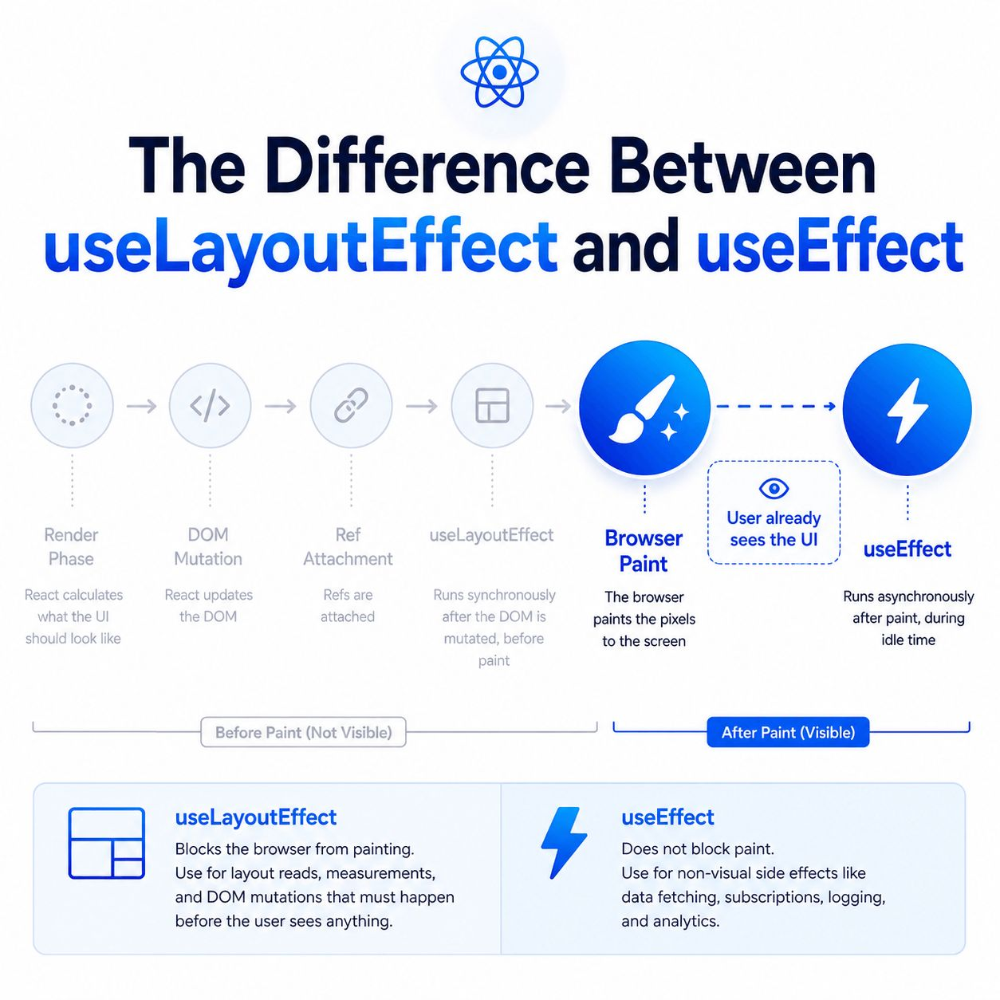

### `useEffect` vs `useLayoutEffect` in React

In React, both `useEffect` and `useLayoutEffect` are hooks that allow you to perform side effects in function components, but they differ in terms of when and how they execute during the component lifecycle. Understanding the difference is crucial for optimizing performance and avoiding unintended side effects.

### **`useEffect`**

- **Purpose**: It is used to perform side effects in function components after the component renders.
- **When it runs**:
  - It runs **after** the render phase is complete, meaning it runs **after the DOM has been updated** and the browser has painted.
  - It is asynchronous and does not block the rendering process.
- **Use Cases**:
  - Fetching data from an API.
  - Subscribing to events.
  - Updating document titles, logging, etc.
  - Changing state based on props or context.

#### **Example**:

```javascript
import { useEffect, useState } from "react";

function MyComponent() {
  const [data, setData] = useState(null);

  useEffect(() => {
    // Fetch data after the component renders
    fetch("https://api.example.com/data")
      .then((response) => response.json())
      .then((data) => setData(data));
  }, []); // Empty dependency array means this runs only once, after the initial render.

  return (
    <div>
      <h1>Data: {data ? data : "Loading..."}</h1>
    </div>
  );
}
```

In this example, the side effect (data fetching) is performed after the component renders, so the initial render won't block.

### **`useLayoutEffect`**

- **Purpose**: It is also used to perform side effects, but it runs **synchronously** after the DOM has been painted, and before the browser paints.
- **When it runs**:
  - `useLayoutEffect` runs **after the DOM has been updated**, but **before the browser has painted** the changes to the screen.
  - This hook is synchronous and can block the paint if the logic inside takes too long.
  - It is useful when you need to make changes that will affect the layout, such as measuring DOM elements or manipulating styles directly.
- **Use Cases**:
  - Measuring DOM nodes (e.g., for determining the position of elements).
  - Synchronously applying styles or class names.
  - Any action where you need to ensure the DOM is updated before the paint (such as animation setups).

#### **Example**:

```javascript
import { useLayoutEffect, useState, useRef } from "react";

function MyComponent() {
  const [width, setWidth] = useState(0);
  const divRef = useRef(null);

  useLayoutEffect(() => {
    // Measure the width of the element after DOM update but before paint
    const measuredWidth = divRef.current.getBoundingClientRect().width;
    setWidth(measuredWidth);
  }, []); // Empty dependency array means this runs once after the initial render.

  return (
    <div>
      <div ref={divRef} style={{ width: "100%" }}>
        Resize me!
      </div>
      <p>The width of the element is: {width}</p>
    </div>
  );
}
```

In this example, `useLayoutEffect` is used to measure the width of a DOM element after it has been updated but before the browser paints the changes. This avoids the flicker or delay that might happen if you measured the DOM after painting.

### **Key Differences**

| Feature              | `useEffect`                                         | `useLayoutEffect`                                                    |
| -------------------- | --------------------------------------------------- | -------------------------------------------------------------------- |
| **Timing**           | Runs after the render (after DOM is painted)        | Runs after DOM update but before paint                               |
| **Blocking**         | Asynchronous (non-blocking)                         | Synchronous (blocks painting)                                        |
| **Performance**      | Preferred for performance-sensitive operations      | May block rendering, causing performance issues if not used properly |
| **Common Use Cases** | Data fetching, subscriptions, logging, side effects | Measuring DOM elements, applying styles before rendering             |

### **When to Use Which Hook?**

- **`useEffect`** is generally sufficient for most use cases. It is non-blocking and will not cause UI flickers. Use it when you don't need to block rendering, like when fetching data, subscribing to events, or performing non-layout related side effects.
- **`useLayoutEffect`** should be used sparingly. It is useful when you need to access the DOM for measurements or make layout-related changes that must happen before the browser paints. Examples include situations where you need to measure the size of an element after it has been rendered or apply synchronous style changes to prevent a visual flicker.

### **Example: Avoiding Layout Shifts**

Imagine you have a case where you need to measure an element's size and apply some styles based on that measurement. If you use `useEffect`, the element might be painted before the styles are applied, causing a layout shift. To avoid this, you can use `useLayoutEffect` to ensure that styles are applied before the paint.

```javascript
import { useLayoutEffect, useState, useRef } from "react";

function MyComponent() {
  const [height, setHeight] = useState(0);
  const divRef = useRef(null);

  useLayoutEffect(() => {
    const newHeight = divRef.current.offsetHeight;
    setHeight(newHeight); // Update state with height, which causes re-render
  }, []); // Runs after DOM update but before paint

  return (
    <div>
      <div ref={divRef}>Content that might change height dynamically</div>
      <p>The height of the div is: {height}</p>
    </div>
  );
}
```

Using `useLayoutEffect` in this case ensures that the height measurement and any style changes based on it are completed before the browser paints, preventing a layout shift that could lead to visual flicker.

### **Performance Considerations**

- **`useEffect`** does not block the UI and is preferred in most scenarios because it allows React to render the component and then apply side effects asynchronously.
- **`useLayoutEffect`**, being synchronous, can block rendering, especially if it performs complex tasks like DOM manipulations or synchronous style changes. It can also cause performance bottlenecks if overused, particularly in large applications.

### **Conclusion**

- Use **`useEffect`** when you don't need to measure the DOM or perform layout-sensitive operations. It's generally more performant and less likely to cause layout shifts.
- Use **`useLayoutEffect`** when you need to measure DOM elements or perform synchronous operations that affect layout or visuals before the browser paints the screen.

In summary, prefer `useEffect` unless you need the synchronous behavior of `useLayoutEffect`, and keep performance in mind to avoid unnecessary rendering blocks.



Based on the timeline provided in "image_5f399a.jpg", the core difference between these two hooks boils down to **timing** and **whether or not they block the browser from painting**.

Here is a breakdown of how they compare within the React rendering pipeline.

### The Timeline Differences

As shown in "image*5f399a.jpg", both hooks fire \_after* React has calculated the UI (Render Phase), updated the real DOM (DOM Mutation), and attached refs (Ref Attachment). The divergence happens right around the **Browser Paint** step.

- **`useLayoutEffect` (Before Paint)**
- **Timing:** It runs **synchronously** immediately after the DOM is mutated, but _before_ the browser is allowed to paint those changes to the screen. The user cannot see the UI yet.
- **Behavior:** It physically blocks the browser from painting until the code inside the hook finishes executing.
- **When to use it:** Use this strictly for layout reads, DOM measurements (like checking the exact scroll position or the width of a `div`), and visual DOM mutations that must happen before the user sees anything to prevent layout shifts or flickering.

- **`useEffect` (After Paint)**
- **Timing:** It runs **asynchronously** _after_ the browser has painted the pixels to the screen. The user already sees the UI.
- **Behavior:** It does not block the paint process. It runs during the browser's idle time, keeping your application responsive and fast.
- **When to use it:** Use this for non-visual side effects. This is the perfect place for data fetching, setting up event listeners, logging, analytics, and subscriptions.

### The Rule of Thumb

Always default to **`useEffect`**. Because it doesn't block the browser's paint cycle, it guarantees a smoother, faster user experience.

You should only reach for **`useLayoutEffect`** if you are encountering a visible "flicker" in your UI—for example, if a component renders in one position, your `useEffect` measures it and moves it, causing the user to see the element quickly jump across the screen.

Would you like to see a code example demonstrating a "visual flicker" scenario and how swapping to `useLayoutEffect` solves it?

# useLayoutEffect vs useEffect

This is one of the most common senior React interview questions.

The key difference is **WHEN they run**.

---

# React Lifecycle Timing

```text
1. Render Phase
      ↓
2. Before Mutation
      ↓
3. Mutation (DOM Updates)
      ↓
4. Refs Attached
      ↓
5. useLayoutEffect
      ↓
6. Browser Paint
      ↓
7. useEffect
```

Remember:

```text
useLayoutEffect
      ↓
BEFORE Paint

useEffect
      ↓
AFTER Paint
```

---

# Visual Timeline

```text
Render
  ↓
DOM Mutation
  ↓
Ref Attachment
  ↓
useLayoutEffect
  ↓
🎨 Browser Paint
  ↓
User sees UI
  ↓
useEffect
```

This is exactly what your diagram illustrates.

---

# useLayoutEffect

Runs:

```text
Synchronously
After DOM Mutation
Before Browser Paint
```

React blocks painting until it finishes.

---

## Example 1: DOM Measurement

```jsx
function Tooltip() {
  const ref = useRef();

  useLayoutEffect(() => {
    const rect = ref.current.getBoundingClientRect();

    console.log(rect.width);
  }, []);

  return <div ref={ref}>Tooltip</div>;
}
```

Why?

```text
Need measurements
Before user sees UI
```

---

## Example 2: Focus Management

```jsx
function Login() {
  const inputRef = useRef();

  useLayoutEffect(() => {
    inputRef.current.focus();
  }, []);

  return <input ref={inputRef} />;
}
```

Result:

```text
Focused before paint
No visual flicker
```

---

## Example 3: Scroll Restoration

```jsx
function ChatWindow() {
  const chatRef = useRef();

  useLayoutEffect(() => {
    chatRef.current.scrollTop = chatRef.current.scrollHeight;
  });

  return <div ref={chatRef} />;
}
```

Used in:

```text
Microsoft Teams
Slack
WhatsApp
Discord
```

because scrolling happens before the user sees the screen.

---

## Example 4: Prevent Layout Shift

```jsx
useLayoutEffect(() => {
  const height = headerRef.current.offsetHeight;

  setHeaderHeight(height);
}, []);
```

Benefits:

```text
No content jump
Better CLS score
Better UX
```

---

# useEffect

Runs:

```text
Asynchronously
After Paint
Does NOT block rendering
```

The user already sees the page.

---

## Example 1: Data Fetching

```jsx
useEffect(() => {
  fetchUsers();
}, []);
```

Perfect use case.

No need to block paint.

---

## Example 2: Analytics

```jsx
useEffect(() => {
  analytics.track("Page Viewed");
}, []);
```

User doesn't need to wait.

---

## Example 3: Subscriptions

```jsx
useEffect(() => {
  socket.connect();

  return () => {
    socket.disconnect();
  };
}, []);
```

---

## Example 4: Logging

```jsx
useEffect(() => {
  console.log("Component Mounted");
}, []);
```

---

# What Happens If You Use Wrong Hook?

## Wrong: Measurement Inside useEffect

```jsx
useEffect(() => {
  const rect = ref.current.getBoundingClientRect();

  setWidth(rect.width);
}, []);
```

Timeline:

```text
Paint
↓
User sees wrong layout
↓
useEffect runs
↓
Layout corrected
```

Result:

```text
Flicker
Layout Jump
Poor UX
```

---

## Correct: Measurement Inside useLayoutEffect

```jsx
useLayoutEffect(() => {
  const rect = ref.current.getBoundingClientRect();

  setWidth(rect.width);
}, []);
```

Timeline:

```text
Measure
↓
Layout Fixed
↓
Paint
```

Result:

```text
No Flicker
```

---

# Performance Impact

## useLayoutEffect

```text
Blocks Paint
Can hurt performance
Use sparingly
```

Bad:

```jsx
useLayoutEffect(() => {
  fetch("/api/users");
});
```

Never do this.

---

## useEffect

```text
Doesn't block paint
Preferred by default
```

Rule:

```text
Start with useEffect

Move to useLayoutEffect only when:
- Measuring DOM
- Managing focus
- Restoring scroll
- Preparing animations
- Preventing visual flicker
```

---

# Comparison Table

| Feature                | useLayoutEffect | useEffect |
| ---------------------- | --------------- | --------- |
| Runs Before Paint      | ✅              | ❌        |
| Runs After Paint       | ❌              | ✅        |
| Blocks Paint           | ✅              | ❌        |
| Safe For Data Fetching | ❌              | ✅        |
| DOM Measurement        | ✅              | ❌        |
| Focus Management       | ✅              | ❌        |
| Analytics              | ❌              | ✅        |
| Subscriptions          | ❌              | ✅        |
| Logging                | ❌              | ✅        |
| Prevent Layout Shift   | ✅              | ❌        |

---

# Interview Trick Question

## Which runs first?

```jsx
useLayoutEffect(() => {
  console.log("layout");
});

useEffect(() => {
  console.log("effect");
});
```

Output:

```text
layout
paint
effect
```

---

## When is ref.current available?

```jsx
useLayoutEffect(() => {
  console.log(ref.current);
});
```

At this moment:

```text
✅ DOM Exists
✅ Ref Attached
✅ Paint Not Happened Yet
```

That's why DOM measurements belong inside useLayoutEffect.

---

# Senior-Level Interview Answer

```text
useLayoutEffect runs synchronously after DOM mutations but before the browser paints. It blocks rendering and is used for DOM measurements, focus management, scroll restoration, animation setup, and preventing layout shifts.

useEffect runs asynchronously after paint and does not block rendering. It is used for data fetching, subscriptions, analytics, logging, and other non-visual side effects.

The general rule is to prefer useEffect and use useLayoutEffect only when visual correctness depends on code running before the user sees the UI.
```

Here is a classic scenario where you will actually see the difference on the screen: positioning a floating element like a tooltip.

Imagine you want to render a tooltip directly below a button. You don't know the tooltip's exact height until it renders in the DOM.

### The Problem: `useEffect` Causes a Flicker

If we use `useEffect`, React will paint the tooltip at its initial position (let's say `top: 0`), and _then_ measure it and move it. The user's eye will catch this jump.

```jsx
import { useState, useEffect, useRef } from "react";

function TooltipWithFlicker({ children }) {
  const [top, setTop] = useState(0);
  const tooltipRef = useRef(null);

  useEffect(() => {
    // 1. The browser HAS ALREADY PAINTED the tooltip at top: 0
    // 2. We measure it
    const height = tooltipRef.current.getBoundingClientRect().height;
    // 3. We update the state, which triggers a re-render
    setTop(height + 10);
    // 4. The browser paints AGAIN. The user sees the tooltip "jump" down.
  }, []);

  return (
    <div ref={tooltipRef} style={{ position: "absolute", top: `${top}px` }}>
      {children}
    </div>
  );
}
```

### The Solution: `useLayoutEffect` Blocks the Paint

By swapping to `useLayoutEffect`, we intercept the browser right before it paints the pixels to the screen.

```jsx
import { useState, useLayoutEffect, useRef } from "react";

function TooltipWithoutFlicker({ children }) {
  const [top, setTop] = useState(0);
  const tooltipRef = useRef(null);

  useLayoutEffect(() => {
    // 1. React updated the DOM to top: 0, but the browser is BLOCKED from painting.
    // 2. We measure the tooltip synchronously.
    const height = tooltipRef.current.getBoundingClientRect().height;
    // 3. We update the state, triggering a synchronous re-render.
    setTop(height + 10);
    // 4. React updates the DOM with the new `top` value.
    // 5. The browser is unblocked and finally paints. The user ONLY sees the final position.
  }, []);

  return (
    <div ref={tooltipRef} style={{ position: "absolute", top: `${top}px` }}>
      {children}
    </div>
  );
}
```

> **The Takeaway:** `useLayoutEffect` forced React to do double the work (two render cycles) before letting the browser show anything to the user. This is exactly why it is slightly worse for performance and why you should only use it when a visual glitch forces your hand.
