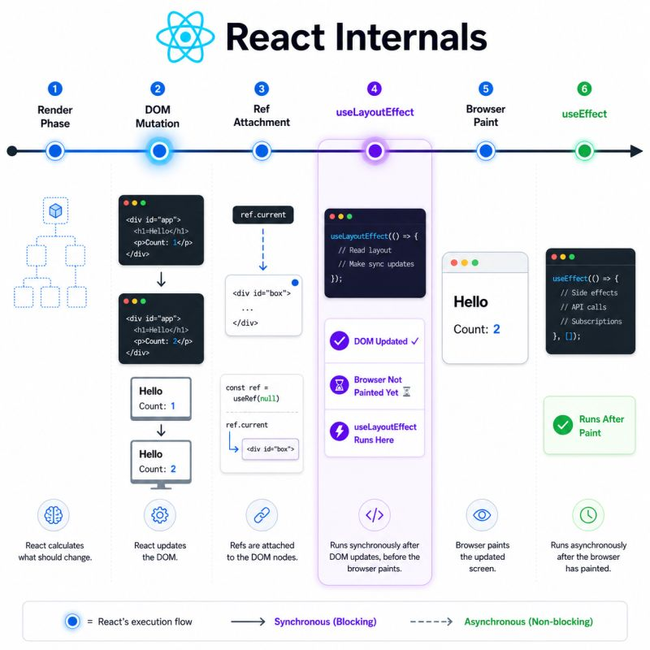

Between the DOM updating and the browser painting, there is a window which many React developers don't know if that exists. This is where useLayoutEffect lives. Here's how 👇

𝗧𝘄𝗼 𝘁𝗵𝗶𝗻𝗴𝘀 𝗵𝗮𝗽𝗽𝗲𝗻 𝗶𝗻 𝘁𝗵𝗶𝘀 𝗽𝗵𝗮𝘀𝗲, 𝗶𝗻 𝘁𝗵𝗶𝘀 𝗼𝗿𝗱𝗲𝗿:

𝟭. 𝗥𝗲𝗳 𝗮𝘁𝘁𝗮𝗰𝗵𝗺𝗲𝗻𝘁𝘀

- Refs are attached to their corresponding DOM nodes here.
- After this step, ref.current reliably points to the correct updated DOM element.
  This is why reading a ref during the Render Phase is unreliable because the DOM may not exist yet.
- The Layout Phase is when ref.current becomes accurate

𝟮. 𝘂𝘀𝗲𝗟𝗮𝘆𝗼𝘂𝘁𝗘𝗳𝗳𝗲𝗰𝘁 𝗰𝗮𝗹𝗹𝗯𝗮𝗰𝗸𝘀

- Cleanup functions from the previous render run first, then the new useLayoutEffect callbacks fire synchronously.
- They run in child-first, parent-last order i.e children complete their layout work before parents measure or adjust based on them.
- This timing makes useLayoutEffect the right choice for DOM measurements, layout calculations, and imperative DOM updates that must be invisible to the user.

𝗢𝗻𝗲 𝗶𝗺𝗽𝗼𝗿𝘁𝗮𝗻𝘁 𝗻𝗼𝘁𝗲: The Layout Phase is blocking. It must finish before the browser paints.

- Heavy work inside useLayoutEffect directly delays what the user sees.

- useLayoutEffect should only be used when its synchronous timing is genuinely necessary

- For everything else like data fetching, subscriptions, logging, useEffect is the right choice (more on this in the next post).

𝗧𝗵𝗲 𝘀𝗶𝗺𝗽𝗹𝗲 𝘄𝗮𝘆 𝘁𝗼 𝗿𝗲𝗺𝗲𝗺𝗯𝗲𝗿 𝗶𝘁:
𝘂𝘀𝗲𝗟𝗮𝘆𝗼𝘂𝘁𝗘𝗳𝗳𝗲𝗰𝘁: DOM updated, before paint, synchronous, blocking
𝘂𝘀𝗲𝗘𝗳𝗳𝗲𝗰𝘁: DOM updated, after paint, asynchronous, non-blocking

𝗪𝗵𝘆 𝘁𝗵𝗶𝘀 𝗺𝗮𝘁𝘁𝗲𝗿𝘀:

- Now you know why useLayoutEffect can cause visible delays if misused.
- Why ref.current is only reliable after the Layout Phase, not during render.
- Why useLayoutEffect is the right tool for tooltip positioning, scroll adjustments and DOM measurements but wrong for almost everything else.

