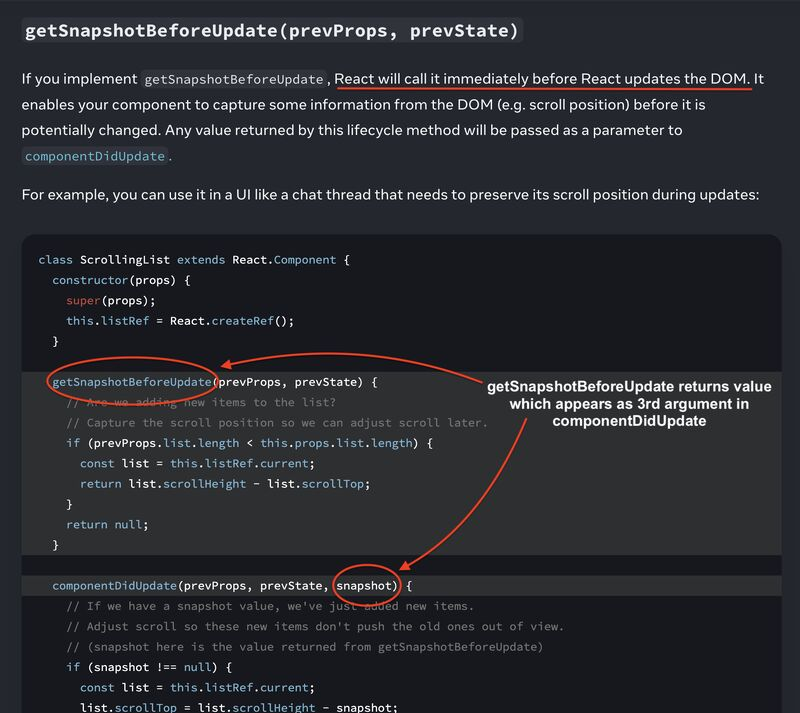

𝗕𝗲𝗳𝗼𝗿𝗲 𝗥𝗲𝗮𝗰𝘁 𝗰𝗵𝗮𝗻𝗴𝗲𝘀 𝗮𝗻𝘆𝘁𝗵𝗶𝗻𝗴 𝗶𝗻 𝘁𝗵𝗲 𝗗𝗢𝗠, 𝗶𝘁 𝗵𝗮𝘀 𝗼𝗻𝗲 𝗹𝗮𝘀𝘁 𝗰𝗵𝗮𝗻𝗰𝗲 𝘁𝗼 𝗿𝗲𝗮𝗱 𝗶𝘁. 𝗜𝗳 𝗶𝘁 𝗺𝗶𝘀𝘀𝗲𝘀 𝘁𝗵𝗶𝘀 𝘄𝗶𝗻𝗱𝗼𝘄, 𝗰𝗲𝗿𝘁𝗮𝗶𝗻 𝗶𝗻𝗳𝗼𝗿𝗺𝗮𝘁𝗶𝗼𝗻 𝗶𝘀 𝗴𝗼𝗻𝗲 𝗳𝗼𝗿𝗲𝘃𝗲𝗿. Here is how 👇

Certain information like scroll positions, element dimensions, layout measurements gets permanently lost once the DOM updates.

The 𝗕𝗲𝗳𝗼𝗿𝗲 𝗠𝘂𝘁𝗮𝘁𝗶𝗼𝗻 𝗣𝗵𝗮𝘀𝗲 exists precisely for this. React runs it before making any DOM changes so components can capture what they need.

𝗴𝗲𝘁𝗦𝗻𝗮𝗽𝘀𝗵𝗼𝘁𝗕𝗲𝗳𝗼𝗿𝗲𝗨𝗽𝗱𝗮𝘁𝗲
The primary function that runs here is getSnapshotBeforeUpdate. It is a class component lifecycle method.
It receives previous props and state, and can return any value. React then passes that value as the third argument to componentDidUpdate.

A real example could be a chat UI where new messages keep arriving at the bottom:

- New messages come in and the DOM is about to update
- Without capturing scroll position first, the UI jumps and pushes the user away from where they were reading
- getSnapshotBeforeUpdate captures the scroll position before the DOM changes
- componentDidUpdate receives it and restores the position after the update
- The user never notices anything changed.

𝗧𝗵𝗲 𝘀𝗶𝗺𝗽𝗹𝗲 𝘄𝗮𝘆 𝘁𝗼 𝗿𝗲𝗺𝗲𝗺𝗯𝗲𝗿 𝗶𝘁:
𝗕𝗲𝗳𝗼𝗿𝗲 𝗠𝘂𝘁𝗮𝘁𝗶𝗼𝗻: read the DOM before React touches it 𝗴𝗲𝘁𝗦𝗻𝗮𝗽𝘀𝗵𝗼𝘁𝗕𝗲𝗳𝗼𝗿𝗲𝗨𝗽𝗱𝗮𝘁𝗲: capture what will be lost after the DOM updates
