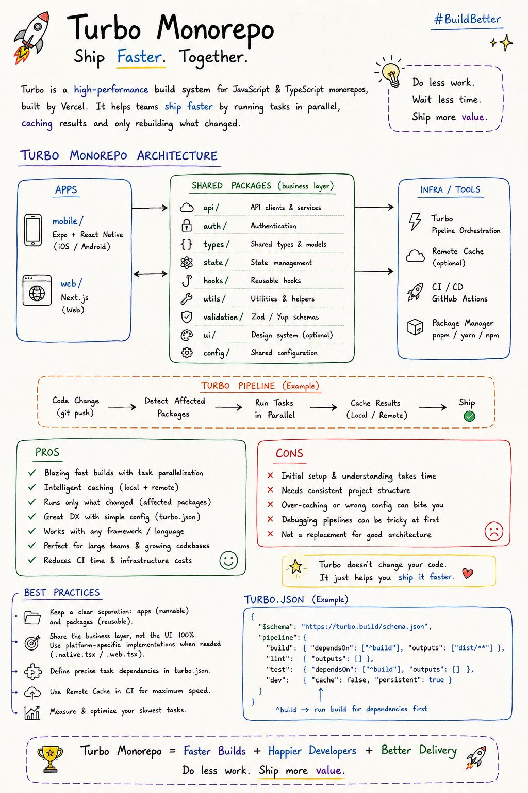

urbo Monorepo: Do less work. Ship more. 🚀
If you're building multiple apps that share the same business logic, a monorepo + Turborepo can make your development workflow significantly cleaner.
For example, imagine this setup:
📱 Mobile → Expo + React Native
🌐 Web → Next.js
📦 Shared packages → API, auth, types, state, validation, hooks, utilities and design tokens
The idea isn't to share 100% of the UI.
It's to share the brain, not the face. 🧠
Why Turborepo?
Turborepo helps orchestrate tasks across packages and apps, with features such as:
⚡ Parallel task execution
💾 Local & remote caching
🎯 Running tasks only where needed
🔄 Dependency-aware pipelines
🤝 Better developer experience for large codebases
🚀 Faster CI/CD workflows
✅ Pros
• Faster builds through task parallelization
• Intelligent caching can avoid repeated work
• Works well as the codebase and team grow
• Clear separation between apps and shared packages
• Makes incremental migration easier
• Great fit for React Native + Next.js architectures
⚠️ Cons
• Initial monorepo setup takes some effort
• Dependency management becomes more important
• Turbo pipelines can take time to understand
• Incorrect caching/configuration can create confusing issues
• A monorepo doesn't automatically mean good architecture
A structure I like
apps/
→ mobile
→ web
packages/
→ api
→ auth
→ types
→ state
→ validation
→ hooks
→ utils
→ ui
Then let each platform own what makes sense.
For example:
Button.native.tsx → React Native implementation
Button.web.tsx → Web implementation

The business logic stays shared, while the presentation can be optimized for each platform.
That's where I think Turborepo becomes really valuable:
One codebase strategy ≠ one UI.

The goal is to maximize meaningful reuse, not chase 100% code reuse.

