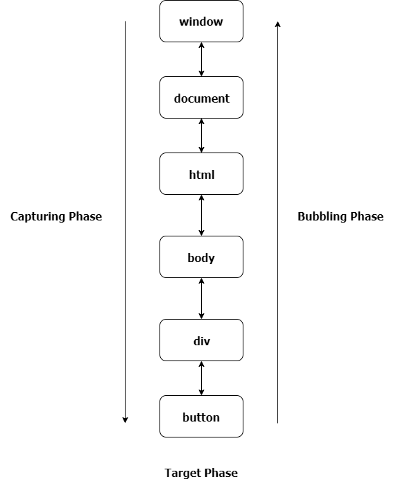

// Event flow is the order in which event is received on the web page. When you click an element that is nested in various other elements, before your click actually reaches its destination, or target element, it must trigger the click event for each of its parent elements first, starting at the top with the global window object.
//     There are two ways of event flow

//     1. Top to Bottom(Event Capturing)
//     2. Bottom to Top (Event Bubbling)

// Event bubbling is a type of event propagation where the event first triggers on the innermost target element, and then successively triggers on the ancestors (parents) of the target element in the same nesting hierarchy till it reaches the outermost DOM element.
// Bubbling means that the event propagates from the target element (i.e. the button the user clicked) up through its ancestor tree, starting from the nearest one. By default, all events bubble.

// Event capturing is a type of event propagation where the event is first captured by the outermost element, and then successively triggers on the descendants (children) of the target element in the same nesting hierarchy till it reaches the innermost DOM element.


When an event occurs on a DOM element, that event does not entirely occur on that just one element. 

In the Bubbling Phase, the event bubbles up or it goes to its parent, to its grandparents, to its grandparent's parent until it reaches all the way to the window.

while in the Capturing Phase the event starts from the window down to the element that triggered the event or the event.target.

Event Propagation has three phases.

**Capturing Phase** – the event starts from window then goes down to every element until it reaches the target element.
**Target Phase** – the event has reached the target element.
**Bubbling Phase** – the event bubbles up from the target element then goes up every element until it reaches the window.


```html
<html>
  <body>
    <div id="btn-container">
      <button class="btn">Click me</button>
    </div>
  </body>
</html>


const ancestors = [
  window, document, document.documentElement,
  document.body, document.getElementById('btn-container')
];

```

// If we add an event listener to each element in the tree, as shown above, we would see a listener fired by the button first, then each one of the others firing from the nearest ancestor all the way up to Window.

// Target phase
document.querySelector('.btn').addEventListener('click', e => {
  console.log(`Hello from ${e.target}`);
});
// Bubble phase
ancestors.forEach(a => {
  a.addEventListener('click', e => {
    console.log(`Hello from ${e.currentTarget}`);
  });
});

// Capturing is the exact opposite of bubbling, meaning that the outer event handlers are fired before the most specific handler (i.e. the one on the button). Note that all capturing event handlers are run first, then all the bubbling event handlers. 
ancestors.forEach(a => {
    a.addEventListener('click', e => {
      console.log(`Hello from ${e.currentTarget}`);
    }, true);
  });


  window.addEventListener('click', e => {
    if (e.target.className === 'btn') console.log('Hello there!');
  });


//   Event propagation
// Having explained event bubbling and capturing, we can now explain the three phases of event propagation:

// During the capture phase, the event starts from Window and moves down to Document, the root element and through ancestors of the target element.
// During the target phase, the event gets triggered on the event target (e.g. the button the user clicked).
// During the bubble phase, the event bubbles up through ancestors of the target element until the root element, Document and, finally, Window.


const addEventListenerAll = (targets, type, listener, options, useCapture) => {
    targets.forEach(target =>
      target.addEventListener(type, listener, options, useCapture)
    );
  };
  
  addEventListenerAll(document.querySelectorAll('a'), 'click', () =>
    console.log('Clicked a link')
  );
  // Logs 'Clicked a link' whenever any anchor element is clicked


  const removeEventListenerAll = (
    targets,
    type,
    listener,
    options,
    useCapture
  ) => {
    targets.forEach(target =>
      target.removeEventListener(type, listener, options, useCapture)
    );
  };
  
  const linkListener = () => console.log('Clicked a link');
  document.querySelector('a').addEventListener('click', linkListener);
  removeEventListenerAll(document.querySelectorAll('a'), 'click', linkListener);


  const addMultipleListeners = (el, types, listener, options, useCapture) => {
    types.forEach(type =>
      el.addEventListener(type, listener, options, useCapture)
    );
  };
  
  addMultipleListeners(
    document.querySelector('.my-element'),
    ['click', 'mousedown'],
    () => { console.log('hello!') }
  );


**What's Event Bubbling?**
↑ When an event occurs on a DOM element, that event does not entirely occur on that just one element. In the Bubbling Phase, the event bubbles up or it goes to its parent, to its grandparents, to its grandparent's parent until it reaches all the way to the window.

If we have an example markup like this.

```html
 <div class="grandparent">
    <div class="parent">
      <div class="child">1</div>
    </div>
  </div>

```
And our js code.

```js
function addEvent(el, event, callback, isCapture = false) {
  if (!el || !event || !callback || typeof callback !== 'function') return;
  if (typeof el === 'string') {
    el = document.querySelector(el);
  };
  el.addEventListener(event, callback, isCapture);
}

addEvent(document, 'DOMContentLoaded', () => {
  const child = document.querySelector('.child');
  const parent = document.querySelector('.parent');
  const grandparent = document.querySelector('.grandparent');

  addEvent(child, 'click', function (e) {
    console.log('child');
  });

  addEvent(parent, 'click', function (e) {
    console.log('parent');
  });

  addEvent(grandparent, 'click', function (e) {
    console.log('grandparent');
  });

  addEvent(document, 'click', function (e) {
    console.log('document');
  });

  addEvent('html', 'click', function (e) {
    console.log('html');
  })

  addEvent(window, 'click', function (e) {
    console.log('window');
  })

});

```

The addEventListener method has a third optional parameter useCapture with a default value of false the event will occur in the Bubbling phase if true the event will occur in the Capturing Phase. If we click on the child element it logs child,parent,grandparent, html, document and window respectively on the console. This is Event Bubbling.


**What's Event Capturing?**
↑ When an event occurs on a DOM element, that event does not entirely occur on that just one element. In Capturing Phase, the event starts from the window all the way down to the element that triggered the event.

If we have an example markup like this.
```html
 <div class="grandparent">
    <div class="parent">
      <div class="child">1</div>
    </div>
  </div>
  ```
And our js code.
```js
function addEvent(el, event, callback, isCapture = false) {
  if (!el || !event || !callback || typeof callback !== 'function') return;
  if (typeof el === 'string') {
    el = document.querySelector(el);
  };
  el.addEventListener(event, callback, isCapture);
}

addEvent(document, 'DOMContentLoaded', () => {
  const child = document.querySelector('.child');
  const parent = document.querySelector('.parent');
  const grandparent = document.querySelector('.grandparent');

  addEvent(child, 'click', function (e) {
    console.log('child');
  }, true);

  addEvent(parent, 'click', function (e) {
    console.log('parent');
  }, true);

  addEvent(grandparent, 'click', function (e) {
    console.log('grandparent');
  }, true);

  addEvent(document, 'click', function (e) {
    console.log('document');
  }, true);

  addEvent('html', 'click', function (e) {
    console.log('html');
  }, true)

  addEvent(window, 'click', function (e) {
    console.log('window');
  }, true)

});

```
The addEventListener method has a third optional parameter useCapture with a default value of false the event will occur in the Bubbling phase if true the event will occur in the Capturing Phase. 

If we click on the child element it logs window,document,html, grandparent and parent and child respectively on the console. This is Event Capturing.


**What's the difference between event.preventDefault() and event.stopPropagation() methods?**
- ↑ The event.preventDefault() method prevents the default behavior of an element. 

- If used in a form element it prevents it from submitting. If used in an anchor element it prevents it from navigating. 

- If used in a contextmenu it prevents it from showing or displaying. 

- While the event.stopPropagation() method stops the propogation of an event or it stops the event from occurring in the bubbling or capturing phase.